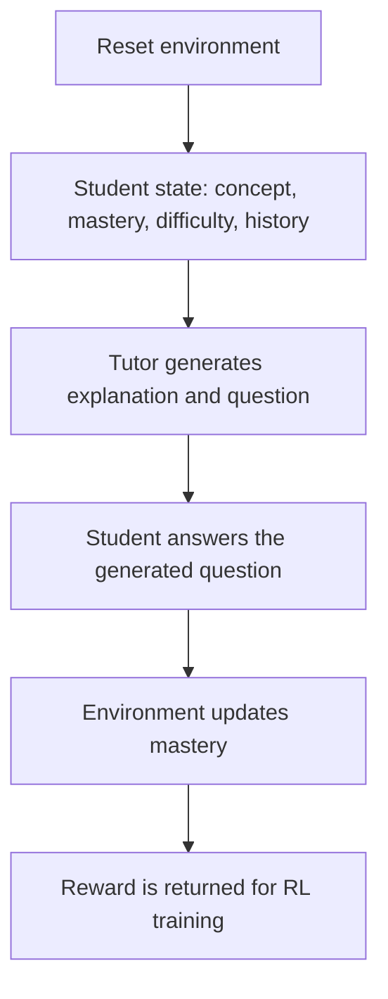

# SkillForge AI: Training an Adaptive DSA Tutor with RL

SkillForge AI is an OpenEnv reinforcement learning environment for training an LLM to become an adaptive DSA tutor. The goal is simple: do not just generate educational content, generate teaching that can be measured.

Most AI tutors can produce an explanation. Many can also produce a practice question. The problem is that these two outputs often drift apart. A model might explain dynamic programming memoization, then ask a question about a different DP pattern. When that happens, the system cannot tell whether the explanation helped the student, because the assessment is not tightly connected to the lesson.

SkillForge AI turns that into an RL problem. The tutor must generate a paired output:

```json
{
  "explanation": "Targeted teaching material for the current student.",
  "question": "A follow-up question that directly tests that material."
}
```

The environment then checks whether this teaching action actually helped a student answer the question and improve mastery.

## What The Environment Does

The environment is an adaptive tutoring loop for data structures and algorithms concepts such as arrays, stacks, trees, backtracking, and dynamic programming.

At the start of an episode, the environment creates a student state with:

- `concept`: the DSA topic being taught.
- `mastery`: the student's current skill level from 0 to 1.
- `targeted_difficulty`: easy, medium, or hard.
- `history`: previous mistakes or question tags from the same student.

The tutor can inspect this state through the `get_state` MCP tool. It then submits one teaching action through `submit_teaching_action`, containing both the explanation and the follow-up question.

The important design choice is that the environment does not hand the model a fixed question bank item. The model has to create the lesson and the assessment together. That makes alignment part of the learning objective, not just a formatting requirement.

## Episode Flow

Each episode is one complete tutoring interaction:



During training, there is no real student sitting in the loop, so the environment simulates one. If an OpenAI-compatible student model is available, it answers as a student with the given mastery level and past mistakes. If not, the code falls back to an analytic probability model based on mastery and difficulty.

During real inference, the simulated student step can be replaced by an actual learner. The same structure still works: the tutor teaches, the student answers, and the system judges whether learning happened.

## The Reward Signal

The reward is based on student outcome, not just text quality.

```text
reward = 0.6 * mastery_gain
       + 0.3 * student_correct
       + 0.1 * student_confidence_if_correct
```

This means the tutor is rewarded when the student improves, answers correctly, and shows confidence. A fluent but disconnected explanation should not score well if it fails to help the student answer the generated question.

The mastery update is intentionally simple. Correct answers move mastery more than incorrect answers, and confidence becomes evidence of how strongly the student understood the concept. This gives the model a scalar reward while keeping the environment interpretable.

## What I Trained

I trained a Qwen 2.5 1.5B adaptive tutor model in two stages.

First, I used supervised fine-tuning to teach the model the output contract: given a concept, mastery score, previous mistakes, and target difficulty, return exactly one JSON object with an `explanation` and a `question`. This stage makes the model reliable enough to participate in the environment without constantly breaking the parser.

Then I used GRPO reinforcement learning on top of the SFT checkpoint:

- Base SFT checkpoint: `Bumpeet/qwen2.5-1.5b-adaptive-tutor-sft`.
- RL method: GRPO using `trl`.
- Training stack: Unsloth, Qwen 2.5 chat template, 4-bit model loading, and LoRA adapters.
- Prompt data: episode flows from `data/episode_flows.json`.
- Reward source: the live `AdaptiveTutorEnvironment`.
- RL output target: `Bumpeet/qwen2.5-1.5b-adaptive-tutor-rl`.

The GRPO training loop generates multiple candidate tutor responses for each student state. Each candidate is parsed, submitted to the environment, evaluated through the simulated student loop, and assigned a reward. Over time, the model is pushed toward explanations and questions that are clearer, better aligned, and more useful for the specific student state.

## Why Targeted Difficulty Matters

In this project, "hard" does not simply mean "ask a harder question." It means the student needs more careful support.

For low mastery, the tutor should explain with simpler intuition and smaller steps. For medium mastery, it should include examples and application practice. For high mastery or hard targets, it can focus on edge cases, reasoning, and optimization. The model sees the target difficulty in the prompt, and the environment uses it when simulating student success.

That makes the tutor adaptive in two ways: it changes what it teaches, and it changes how it teaches.

## Deployment And Evaluation

The trained model is served through a Hugging Face Inference Endpoint with a custom `handler.py`. The handler loads the model, wraps the incoming prompt in the Qwen chat template, generates the assistant response, and returns the generated text.

The evaluation script runs the model through the OpenEnv environment using three task types:

- `concept_recall`
- `application_practice`
- `advanced_analysis`

For each task, the script resets the environment, gets the current student state, calls the tutor model, submits the teaching action, and logs the final reward.

## What This Demonstrates

SkillForge AI is a small but complete example of using reinforcement learning for adaptive education. The agent is not rewarded for sounding like a tutor. It is rewarded for producing teaching material that leads to a better student outcome.

The central idea is alignment between instruction and assessment. The explanation and question are generated as one unit, evaluated as one teaching action, and optimized through the environment reward. That makes the system useful not only as a DSA tutor, but also as a pattern for training educational agents where learning progress matters more than generic content quality.
