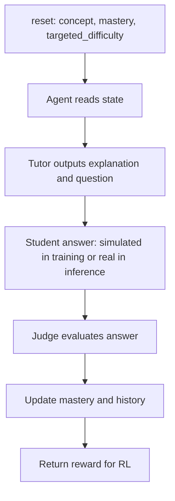

# SkillForge AI: Adaptive Tutor Environment

**Hackathon:** Meta x Hugging Face OpenEnv Challenge

SkillForge AI is an OpenEnv reinforcement learning environment for training an LLM to act as an adaptive DSA tutor. The tutor does not only generate a lesson; it must generate both the learning material and the follow-up question in one structured output, so the assessment is directly grounded in what the student just learned.

The environment rewards teaching that produces measurable learning. A student reads the generated material, answers the generated question, receives an independent judgment, and updates mastery over time. This turns tutoring quality into an RL signal: better explanations and better aligned questions should lead to stronger student answers, higher mastery, and better rewards.

## Why This Problem Matters

Many AI learning platforms, including well-known products such as [Workera.ai](https://workera.ai/), can generate learning material and practice questions. The gap is that these two pieces are often weakly connected: the model may explain one idea, then test a slightly different one. When that happens, the student is not being evaluated on the concept they were just taught, and the system cannot reliably know whether the generated material caused learning.

This matters most for adaptive education. If a student is struggling, the system should not simply generate another random practice question. It should understand the student's current mastery, explain the missing concept in the right format, and then ask a question that tests that exact explanation.

SkillForge AI solves this by making the tutor generate a paired output:

```json
{
  "explanation": "Targeted learning material for the current student state.",
  "question": "A follow-up question that directly tests that material."
}
```

Reinforcement learning then optimizes the tutor for student progress, not just fluent text. The model learns to produce material that is useful, testable, and connected to the student's actual weakness.

## Core Idea

Each episode is a small adaptive tutoring loop. The environment provides the tutor with enough context to personalize the lesson, then measures whether that lesson helped:

1. The environment starts with a student state: `concept`, `mastery`, `targeted_difficulty`, and past mistakes.
2. The tutor model generates one explanation and one question that directly tests that explanation.
3. The answer is evaluated to decide whether the student understood the material.
4. Mastery, history, and reward are updated for the next curriculum step.

This keeps the learning material and assessment connected. The model is not rewarded for generic content; it is rewarded for teaching that leads to measurable progress.

## Training vs Real Inference

The answer source changes depending on where the system is running. During RL training, there may not be a real student available, so ChatGPT can simulate a student with a specific mastery level. During real inference, the actual student takes the exam, so the simulated-student call is not needed.

| Stage | Who answers the generated question? | ChatGPT student call | Judge call | Why it matters |
|---|---|---|---|---|
| RL training / environment simulation | A simulated student with the given `mastery` and past mistakes | Used as call 1 to produce a student-like answer | Used as call 2 to evaluate the answer | Creates a repeatable reward signal for RL |
| Real inference / exam mode | The actual student takes the exam | Not used | Used to judge the real student's answer | Measures the real learner instead of a simulated one |

The student and judge are separate roles. During real inference, the ChatGPT student simulation is skipped because the actual student takes the exam.

## Environment Flow



## MCP Tools

The environment is implemented around two MCP tools:

- `get_state`: returns the current tutoring context, including concept, mastery, targeted difficulty, and history.
- `submit_teaching_action`: accepts the tutor's `explanation` and `question`, runs evaluation, updates mastery, and returns reward metadata.

On `reset`, the environment chooses the concept and difficulty for the next lesson. The tutor sees the student's current mastery and previous mistakes, then must produce a JSON object with exactly two fields: `explanation` and `question`.

The key design choice is that the environment does not hand the tutor a fixed question bank question. The tutor must create the content and assessment together, and the environment evaluates the resulting teaching interaction. If external evaluator calls are unavailable, the code includes fallback logic so the environment can still run locally.

## Targeted Difficulty

`targeted_difficulty` tells the tutor how much support the student needs:

- `easy`: teach fundamentals, definitions, and intuition.
- `medium`: include examples and application practice.
- `hard`: assume the student is learning slowly or struggling with the topic, so the material should be more refined, descriptive, and well structured with clear bullet points.

This makes the curriculum adaptive. The model is not just changing the question difficulty; it is changing how carefully and explicitly it teaches. For example, a hard targeted difficulty does not mean "make the student suffer with a harder problem." In this environment, it means the student needs more support: clearer structure, smaller steps, stronger examples, and more precise assessment.

## Reward Signal

The reward focuses on student outcome:

```text
reward = 0.6 * mastery_gain
       + 0.3 * student_correct
       + 0.1 * student_confidence_if_correct
```

This means the tutor is rewarded when the student actually improves, answers correctly, and shows confidence. The environment is designed to discourage disconnected or superficial content, because a question that does not match the explanation should not help the student perform well. Over many episodes, RL should push the tutor toward explanations that are clear, targeted, and immediately testable.


The important part is alignment: the question directly tests the concept explained in the material. A judge can inspect this output and quickly see whether the system is solving the central problem: keeping the lesson and assessment connected.

## Results

Final links and metrics will be added here before submission:

- Hugging Face model: [qwen2-5-1-5b-adaptive-tutor](https://emx0oc53cv608mb6.eu-west-1.aws.endpoints.huggingface.cloud)
- Hugging Face Space/OpenEnv environment: [Bumpeet/adaptive_tutor_env](https://huggingface.co/spaces/Bumpeet/adaptive_tutor_env)
- Website: [skillforzai.vercel.app](https://skillforzai.vercel.app)
- Mini Blog: [Blog](BLOG.md)
- Demo Flow: [Demo](Demo.md)
- Supervised fine-tuning run: [Colab notebook](https://colab.research.google.com/drive/1N8A-tDOzF81Wnw1w89fffkVvUNjl0ql_?usp=sharing)

  | Epoch | Eval loss | Runtime | Samples/sec | Steps/sec |
  |---|---:|---:|---:|---:|
  | 1 | 1.978 | 2.099 | 2.858 | 0.953 |
  | 2 | 1.751 | 1.419 | 4.229 | 1.410 |
  | 3 | 1.691 | 1.498 | 4.005 | 1.335 |

- Reinforcement Learning: [Colab notebook](https://colab.research.google.com/drive/1mBAes6HfHDNLiiclSIXD6a4smpuGzpoe?usp=sharing)

- Sample generated lessons:

```json
{
  "explanation": "Dynamic programming helps when a problem has overlapping subproblems. Instead of solving the same subproblem many times, we store the answer and reuse it. For Fibonacci, fib(5) needs fib(4) and fib(3); fib(4) also needs fib(3), so memoization prevents recomputing fib(3).",
  "question": "In the Fibonacci example, why does memoization make the recursive solution faster?"
}
```

Current qualitative result: the environment can run an end-to-end tutoring episode, produce a structured teaching action, simulate a student answer, update mastery, and emit a scalar reward for RL.

## Quick Start

Install dependencies:

```bash
pip install -e .
```

Run the environment server:

```bash
uvicorn adaptive_tutor_env.server.app:app --reload --port 8000
```

Run the inference script:

```bash
HF_TOKEN=hf_xxx OPENAI_API_KEY=sk-xxx python inference.py
```

Run against a local or hosted model endpoint:

```bash
API_BASE_URL=http://localhost:8080/v1 MODEL_NAME=my-model HF_TOKEN=dummy python inference.py
```

Build and run with Docker:

```bash
docker build -t adaptive-tutor:latest .
docker run -p 8000:8000 -e OPENAI_API_KEY=sk-xxx adaptive-tutor:latest
```

## Main Files

- `server/tutor_environment.py`: OpenEnv/MCP environment, episode state, tools, mastery update flow.
- `server/student_model.py`: student simulation prompts, fallback simulator, mastery update helpers.
- `server/rewards.py`: reward function used by the RL loop.
- `inference.py`: hackathon evaluation runner.
- `rl_train.py`: GRPO training entry point.
- `handler.py`: Hugging Face Inference Endpoint handler for the trained tutor model.

## Environment Variables

- `HF_TOKEN`: Hugging Face token for model inference.
- `OPENAI_API_KEY`: enables ChatGPT-backed student and judge calls.
- `STUDENT_MODEL_NAME`: optional model name for the student simulator.
- `API_BASE_URL`: OpenAI-compatible model endpoint.
- `MODEL_NAME`: tutor model identifier.
- `LOCAL_IMAGE_NAME`: optional Docker image for OpenEnv evaluation.
- `JUDGE_BASE_URL`: optional custom judge endpoint.
- `STUDENT_OPENAI_BASE_URL`: optional custom student simulator endpoint.

## Submission Summary

SkillForge AI turns adaptive tutoring into a measurable RL problem. The tutor is not rewarded for producing generic educational text; it is rewarded for generating connected teaching material and assessment that help a simulated student improve.
